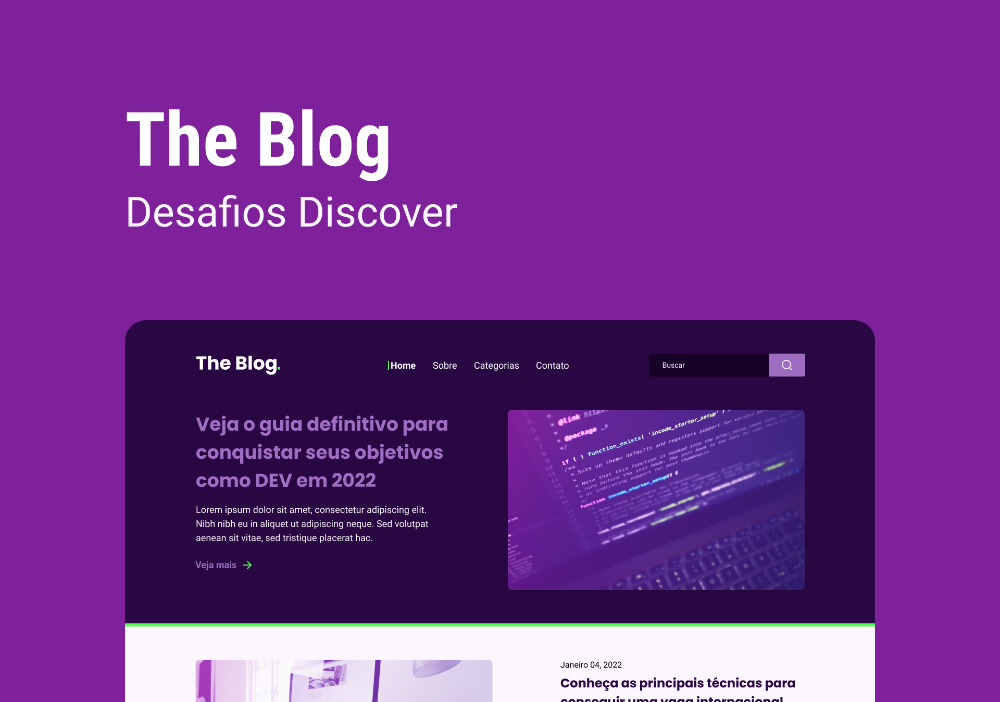

<h1 align="center">The Blog 👨🏽‍💻 </h1>

Homepage para um blog

  <a href="#-tecnologias">Tecnologias</a>&nbsp;&nbsp;&nbsp;|&nbsp;&nbsp;&nbsp;
  <a href="#-projeto">Projeto</a>&nbsp;&nbsp;&nbsp;|&nbsp;&nbsp;&nbsp;

 

  

## 🚀 Tecnologias

Esse projeto foi desenvolvido com as seguintes tecnologias:

- HTML e CSS
- Git e Github

## 💻 Projeto

O projecto foi desenvolvido com fins didáticos, com o intuito criar uma homepage para um blog de tecnologia

Feito com ♥ by Daniel Koti
